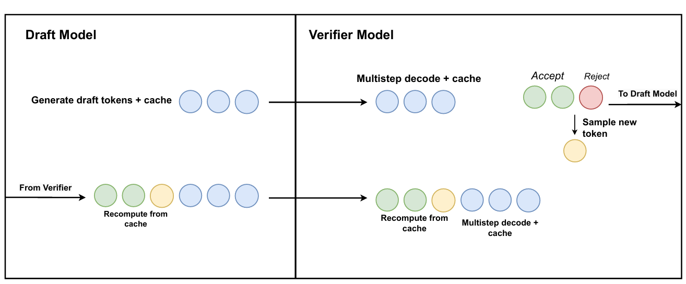
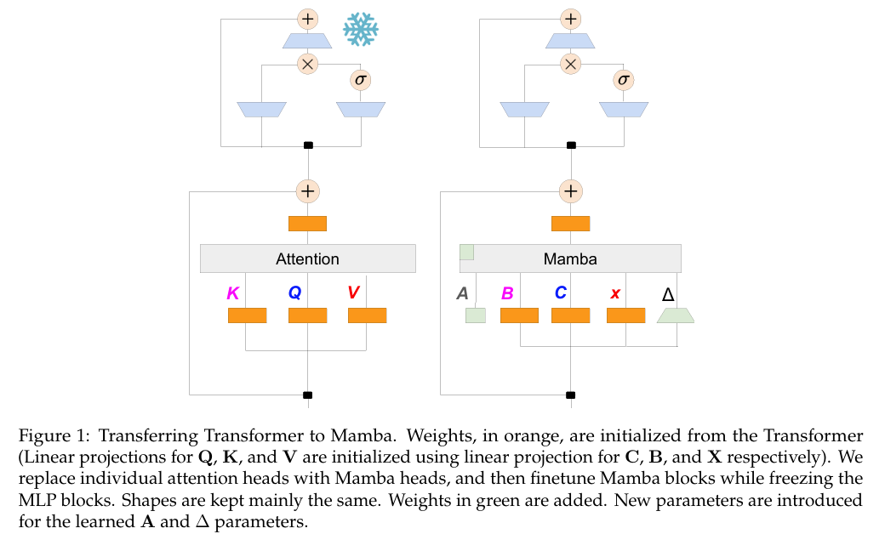
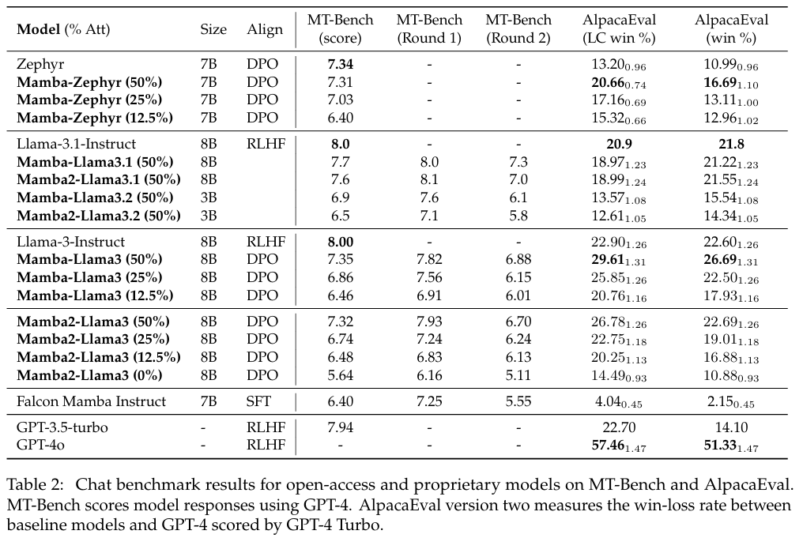
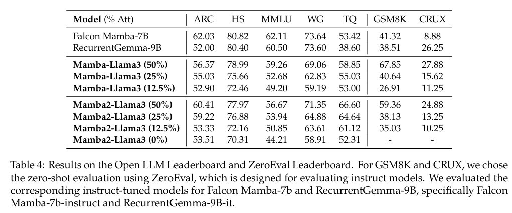
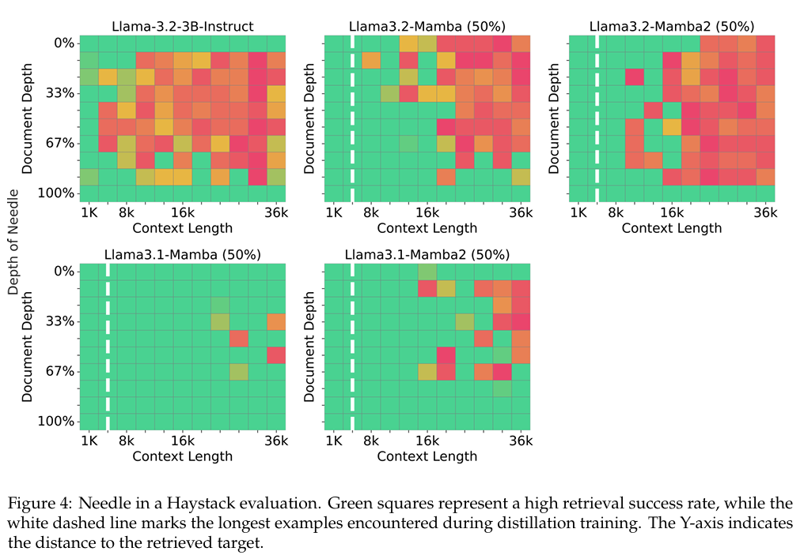
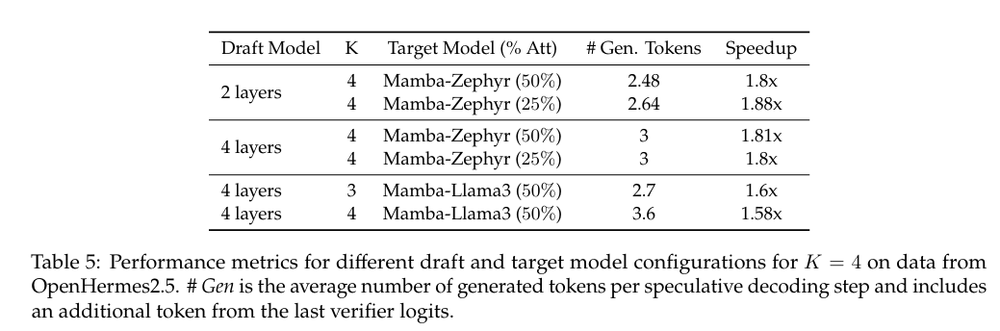
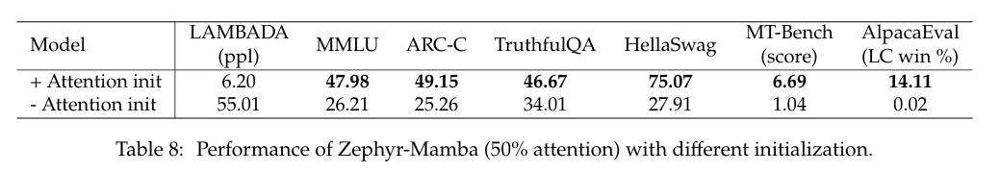
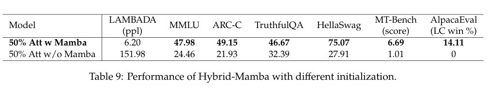
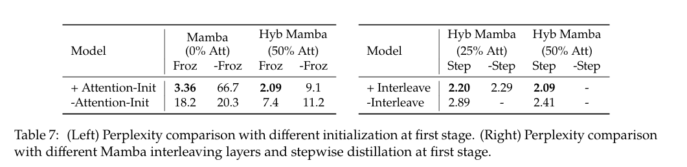

# [The Mamba in the Llama: Distilling and Accelerating Hybrid Models](https://arxiv.org/pdf/2408.15237)
* Read Date: 2025/01/12
* Neurips 2024

**TL;DR**
This paper proposes a method to distill large Transformer model into linear RNN (like Mambda). The goal of the paper is to reduce the computational inefficiency of Transformers due to their quadratic complexity and large memory requirements. 

### Background
* Transformers are the backbone foundation of existing LLM successes. However, it is computational intensive especially for tasks requiring long-sequence generation due to their quadratic complexity and large key-value caches.
* Linear RNN architecture are faster during inference (5x throughput compared to Tranformers)
* Hence, this paper aims to bridge the gap by distilling Transformers into hybird models that combine linear RNNs and Transformer layers.

### Method
#### Distillation
Large Transformer models can be distilled into linear RNN by reusing weights from attention layers. To do this, a multi-stage distillation approach is employed:
* Initialization: Init RNN layers with the Transformer weights
* Progressive Layer Replacement: Transformer attention layers are replaced with RNNs stepwise.
* Fine-Tuning: Hybrid models are refined using knowledge distillation techniques like KL divergence and pseudo-labeling.

#### Speculative Decoding
* Users a faster Draft model to perform generation. User a large model to perform verify that allow multiple tokens to be generated in parallel.

#### Hybird Model
Combines linear RNN with Transformer layers.

### Experiments and Analysis
* Distilled models match or exceed the teacher Transformer model in performance on several benchmarks like AlpacaEval and MT-Bench, while being faster in inference.
    
    
* Long-context evaluation tasks (e.g., Needle in a Haystack) demonstrate that the distilled models can extrapolate well beyond training lengths.
    
* Speculative decoding yields significant speedups, especially on hybrid architectures, with over 2× throughput gains on certain configurations.
    
* Initialization Matters: Using Transformer weights for initialization significantly enhances performance compared to training RNN models from scratch. Both attention weights and Mambda blocks are important:
    
    
    
    * Table7(Left) presents the results of distillation with various initializations. It sugeested that initing with attention weights from tranformers is crucial. Also freezing MLP layers can help the student model focus on learning the interaction of tokens 
